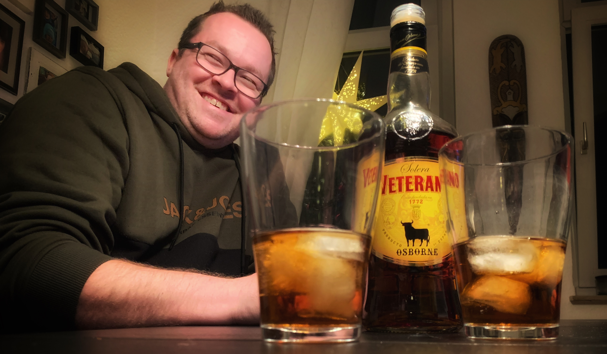

= Master Blender
// https://docs.asciidoctor.org/reveal.js-converter/latest/
:revealjs_theme: moon

== Ehre wem Ehre gebührt

== Veterano Osbourne
Ein Getränk für besondere Genießer, die dem Bier entsagen und den besonderen Geschmack erleben möchten.

Veterano Osbourne wird bei Zimmertemparatur serviert. Kenner veredeln mit kalter Cola und Eis.

== Welche Aufgaben hat der Master Blender?
Der Master Blender trägt eine große Verantwortung auf seinen Schultern.

Die Aufgabe des Master Blender ist das korrekte Einhalten des Mischverhältnis von Osbourne und Cola.

Er ist es, der dafür sorgt, dass jedes Glas über Stunden den gleichen Geschmack aufweist.

== Erfahrung ist das Wichtigste
Doch wie schafft ein Master Blender dieses Kunststück überhaupt und welche besonderen Eigenschaften zeichnen ihn aus?

Jahrelange Erfahrung im Mischen von Osbourne mit Cola ist essenziell, um dieser verantwortungsvollen Aufgabe gerecht zu werden und ein konstantes Mischverhältnis sicherzustellen. Dabei spielt die Größe des Glases nur eine untergeordnete Rolle.

== Eine besondere Aufgabe
Dabei muss ein Master Blender jedoch auch stets den Blick in die Zukunft richten. Es ist der Master Blender, der unter den zahlreichen Gläsern den Überblick behält und den Füllstand überwacht. Ein gutes Glas-Management ist also das A und O.

== Die Besten der Besten
Nicht jeder Osbourne-Trinker ist den Aufgaben, die das Amt des Mater Blender mit sich bringt, gewachsen. Viele Anwärter scheitern an der Verantwortung.

Nur erfahrene Osbourne-Veteranen, die sich über Jahre auszeichnen, kommen für dieses Amt in Frage.

