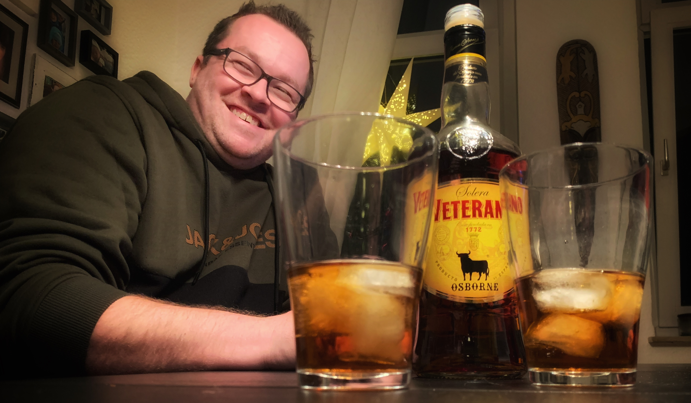

= Masterblender
// https://docs.asciidoctor.org/reveal.js-converter/latest/
:revealjs_theme: moon

== Ehre wem Ehre gebührt

== Veterano Osbourne
Ein Getränk für besondere Genießer, die dem Bier entsagen und den außergewöhnlichen Geschmack erleben möchten.

Veterano Osbourne wird bei Zimmertemparatur serviert. Kenner veredeln mit kalter Cola und Eis.

== Welche Aufgaben hat der Masterblender?
Der Masterblender trägt eine große Verantwortung auf seinen Schultern.

Die Aufgabe des Masterblender ist das korrekte Einhalten des Mischverhältnis von Osbourne und Cola.

Er ist es, der dafür sorgt, dass jedes Glas über Stunden den gleichen Geschmack aufweist.

== Erfahrung ist das Wichtigste
Doch wie schafft ein Masterblender dieses Kunststück überhaupt und welche besonderen Eigenschaften zeichnen ihn aus?

Jahrelange Erfahrung im Mischen von Osbourne mit Cola ist essenziell, um dieser verantwortungsvollen Aufgabe gerecht zu werden und ein konstantes Mischverhältnis sicherzustellen. Die Größe des Glases spielt dabei nur eine untergeordnete Rolle.

== Eine besondere Aufgabe
Dabei muss ein Masterblender jedoch auch stets den Blick in die Zukunft richten. Es ist der Masterblender, der unter den zahlreichen Gläsern den Überblick behält und den Füllstand überwacht. Ein gutes Glas-Management ist also das A und O.

== Die Besten der Besten
Nicht jeder Osbourne-Trinker ist den Aufgaben, die das Amt des Mater Blender mit sich bringt, gewachsen. Viele Anwärter scheitern an der enormen Verantwortung.

Nur die erfahrensten unter den Osbourne-Veteranen können sich über Jahre auszeichen und in dieses Amt berufen werden.

